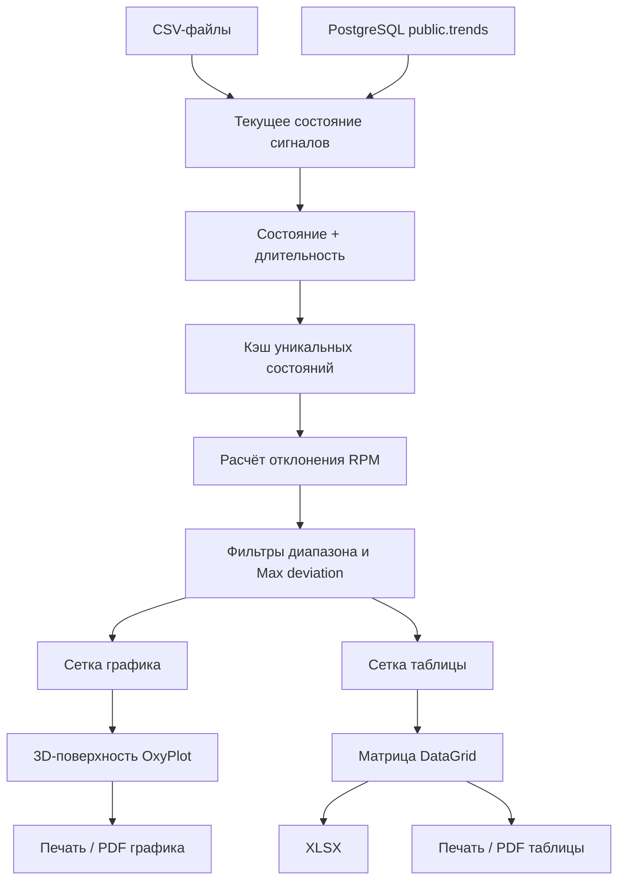

# EngineAnalyzer: архитектура и функции

## Назначение

EngineAnalyzer анализирует устойчивость оборотов двигателя относительно номинального значения. Программа читает события из CSV или PostgreSQL, восстанавливает полное состояние сигналов методом `forward-fill`, вычисляет длительность каждого состояния и строит:

- трёхмерную поверхность взвешенного по времени RMS;
- матрицу RMS для выбранных осей X и Y;
- печатные версии графика и таблицы;
- книгу Excel с матрицей и цветовой шкалой.

Главное окно реализовано набором `partial`-классов. Это сохраняет стандартную модель WPF `MainWindow` и одновременно разделяет загрузку, анализ и представление по отдельным файлам.

## Структура проекта

```text
EngineAnalyzer/
├── MainWindow.xaml                 Разметка главного окна
├── MainWindow.xaml.cs              Точка входа partial-класса и ссылка на этот документ
├── App.xaml
├── App.xaml.cs
├── Core/
│   ├── GlobalUsings.cs             Общие пространства имён
│   └── MainWindow.Core.cs          Состояние окна, настройки, конструктор, сетки, OxyPlot
├── Data/
│   ├── MainWindow.Csv.cs           CSV, выбор столбцов, forward-fill, кэш состояний
│   └── MainWindow.PostgreSql.cs    Чтение событий trends и начальных значений тегов
├── Analysis/
│   └── MainWindow.Analysis.cs      Фильтрация, RMS, сетки, поверхность и матрица
├── Presentation/
│   ├── MainWindow.Plot3D.cs        3D-проекция, поверхность, оси и управление камерой
│   └── MainWindow.ExportAndPrint.cs Печать, PDF и формирование XLSX
├── UI/
│   └── MainWindow.UI.cs            Обновление, состояние UI, разбор настроек и утилиты
├── Models/
│   └── AnalysisModels.cs           Ячейка агрегации и геометрические модели
└── ARCHITECTURE.md                 Этот документ
```

## Общий поток данных



## Core/MainWindow.Core.cs

Файл содержит поля состояния приложения и первоначальную настройку окна.

Основные группы данных:

- диапазоны и шаги отдельных сеток графика и таблицы;
- номинальные обороты и максимально допустимое отклонение;
- двумерные массивы `graphCells` и `tableCells`;
- кэш `observationCache`;
- выбранные CSV-столбцы и PostgreSQL ID;
- заголовки осей;
- состояние виртуальной камеры;
- модель OxyPlot.

Основные функции:

- `MainWindow()` — инициализирует XAML, график и сетки;
- `ConfigureGrid()` — читает параметры интерфейса, проверяет диапазоны и создаёт массивы ячеек;
- `GetBinCount()` — определяет количество узлов сетки;
- `ClearData()` — очищает результаты и кэш;
- `SetupPlot()` — создаёт скрытые двумерные оси OxyPlot и отключает стандартное управление мышью.

Внутренние имена `Temperature` и `Power` сохранены для совместимости с предыдущей версией. В текущем интерфейсе они означают выбранные пользователем оси X и Y и не требуют именно температуры или мощности.

## Data/MainWindow.Csv.cs

CSV-загрузчик работает с несколькими файлами в порядке выбора.

### Выбор столбцов

После открытия первого файла его заголовки добавляются в выпадающие списки. Пользователь выбирает:

- столбец времени;
- сигнал оси X;
- сигнал оси Y;
- `Engine Speed` или готовое отклонение.

`CsvColumnMapping` фиксирует выбор на время фоновой загрузки. Если выбор изменён, кнопка **Обновить** перечитывает последние CSV.

### Восстановление состояния

`UpdateForwardFilledValue()` реализует поведение прежнего Polars `forward_fill`:

- пустая строка сохраняет последнее известное значение;
- корректное число заменяет текущее значение;
- непустое некорректное значение сбрасывает сигнал в `null`.

`ProcessState()` принимает восстановленное состояние и длительность до следующего события. Неполные состояния не попадают в кэш.

Ключ кэша:

```text
(X, Y, RPM или готовое отклонение, признак готового отклонения)
```

Для одинаковых состояний суммируются длительность и количество интервалов. Это уменьшает объём повторных расчётов при изменении шага сетки.

## Data/MainWindow.PostgreSql.cs

PostgreSQL хранит значения по изменению в `public.trends`:

```text
t   — время события
id  — ID сигнала
v   — новое значение
```

По умолчанию используются:

| Назначение | ID | Имя |
|---|---:|---|
| Ось X | 569 | IntTempOut |
| Ось Y | 558 | Power |
| RPM | 625 | Engine Speed |

ID редактируются в интерфейсе.

Алгоритм загрузки:

1. Открывается транзакция `RepeatableRead`.
2. Для каждого ID читается последнее непустое значение перед началом периода.
3. События периода читаются по времени.
4. События с одинаковым временем применяются как единый переход состояния.
5. Состояние между соседними событиями получает вес, равный длительности интервала.
6. Последнее состояние учитывается до указанной даты окончания.

Запросы используют массив выбранных ID через `ANY(...)`. `ApplyTrendEvent()` направляет значение в X, Y или RPM по настроенной карте сигналов.

## Analysis/MainWindow.Analysis.cs

### Отклонение оборотов

Для обычного сигнала оборотов:

```text
deviation = abs(engineSpeed - nominalRpm)
```

Для готового столбца отклонения:

```text
deviation = abs(sourceDeviation)
```

### Фильтрация

Интервал исключается, если:

- X, Y, deviation или длительность не являются конечными числами;
- длительность меньше или равна нулю;
- deviation превышает `maxAllowedDeviation`;
- X и Y не входят ни в диапазон графика, ни в диапазон таблицы.

Если состояние попадает только в один из диапазонов, оно участвует только в соответствующем представлении.

### Распределение по сетке

Значение направляется в ближайший узел:

```text
index = round((value - minimum) / step)
```

График и таблица имеют независимые диапазоны и шаги.

### Взвешенный RMS

`AggregateCell.Add()` сохраняет сумму квадратов отклонений с временным весом:

```text
weightedSumSquares += deviation² × durationSeconds
totalWeightSeconds += durationSeconds
```

Значение ячейки:

```text
RMS = sqrt(weightedSumSquares / totalWeightSeconds)
```

`RebuildFromCache()` повторяет фильтрацию и агрегацию при изменении номинальных оборотов, допустимого отклонения, диапазона или шага. Исходный источник при этом не читается повторно.

`BuildSurface()` формирует массив высот графика, а `BuildSurfaceMatrix()` создаёт `DataTable` и столбцы WPF `DataGrid`.

## Presentation/MainWindow.Plot3D.cs

OxyPlot используется как двумерный холст для собственной 3D-проекции.

Преобразование выполняется в два этапа:

1. `ToScene()` переводит физические значения X, Y и RMS в координаты сцены.
2. `ProjectPoint()` применяет повороты камеры и перспективную проекцию.

Поверхность состоит из `PolygonAnnotation`. Полигоны сортируются по глубине перед отрисовкой.

Управление:

- левая кнопка мыши и перемещение — вращение;
- колесо мыши — масштаб;
- **Сбросить вид** — исходные углы и масштаб.

Цветовая шкала общая для графика, таблицы и Excel:

- 0 rpm — пастельно-зелёный;
- промежуточные значения — зелёный → жёлтый → красный;
- 12 rpm и выше — пастельно-красный.

Порог 12 rpm управляет только цветом и не является фильтром.

## Presentation/MainWindow.ExportAndPrint.cs

Файл содержит три независимых механизма вывода:

- `PrintPdf_Click()` и `CreatePrintDocument()` — печать матрицы через `FlowDocument`;
- `PrintGraph_Click()` — печать текущего визуального состояния графика;
- `ExportExcel_Click()` — сохранение матрицы в `.xlsx`.

XLSX создаётся средствами `ZipArchive` и `XmlWriter`, поэтому дополнительный пакет для Excel не нужен. Книга содержит заголовки выбранных осей, закреплённую первую строку и столбец, числовые RMS и цветовые стили.

## UI/MainWindow.UI.cs

Файл объединяет обработчики, не относящиеся к конкретному источнику или способу представления:

- `Update_Click()`;
- блокировка кнопок во время фоновой операции;
- вывод прогресса и ошибок;
- разбор чисел и дат;
- чтение CSV с учётом кавычек и разделителей;
- математические вспомогательные функции.

Поведение кнопки **Обновить**:

- при изменении только диапазонов, шагов, номинала или названий осей выполняется пересчёт из кэша;
- при изменении CSV-столбцов последние CSV читаются повторно;
- при изменении PostgreSQL ID, подключения или периода PostgreSQL читается повторно.

## Models/AnalysisModels.cs

### AggregateCell

Хранит статистику одной ячейки:

- количество добавлений;
- суммарный временной вес;
- взвешенную сумму;
- взвешенную сумму модулей;
- взвешенную сумму квадратов;
- минимум и максимум;
- вычисляемые `Mean`, `MeanAbs` и `Rms`.

### ScenePoint и ProjectedPoint

`ScenePoint` представляет трёхмерную координату до проекции. `ProjectedPoint` содержит экранные координаты и глубину.

### RenderSurfaceCell

Содержит четыре проецированные вершины полигона, его глубину и RMS для окрашивания.

## Кэш и ограничения

Текущий кэш объединяет одинаковые состояния независимо от времени их появления. Это подходит для матрицы и поверхности RMS, но не сохраняет хронологию.

Для будущего анализа раскачки, FFT, автокорреляции, последовательных пиков и скользящих окон необходимо добавить отдельное хронологическое хранилище интервалов. Его следует использовать параллельно с существующим агрегированным кэшем, чтобы не ухудшить скорость перестроения матрицы.

## Добавление нового источника

Новый загрузчик должен:

1. восстановить значения X, Y и RPM/отклонения;
2. определить длительность состояния;
3. заполнить `EngineState`;
4. вызвать `ProcessState(state, durationSeconds)`;
5. после загрузки вызвать `FinishProcessing()`.

Фильтрацию, сетки, RMS и визуализацию повторять в загрузчике не нужно.

## Добавление нового показателя

Статистику, вычисляемую внутри ячейки, следует добавлять в `AggregateCell`. Отображение нового показателя меняется в `BuildSurface()`, `BuildSurfaceMatrix()` и экспорте.

Показатели, зависящие от порядка событий, нельзя вычислять из `observationCache`; для них требуется хронологический список интервалов.

## Зависимости

```text
WPF / .NET 10
Npgsql 10.0.3
OxyPlot.Wpf 2.2.0
```

## Проверка сборки

```powershell
dotnet build ScottPlotWpfDemo.csproj
```

Название файла проекта сохранено для совместимости, хотя библиотека визуализации заменена со ScottPlot на OxyPlot.
