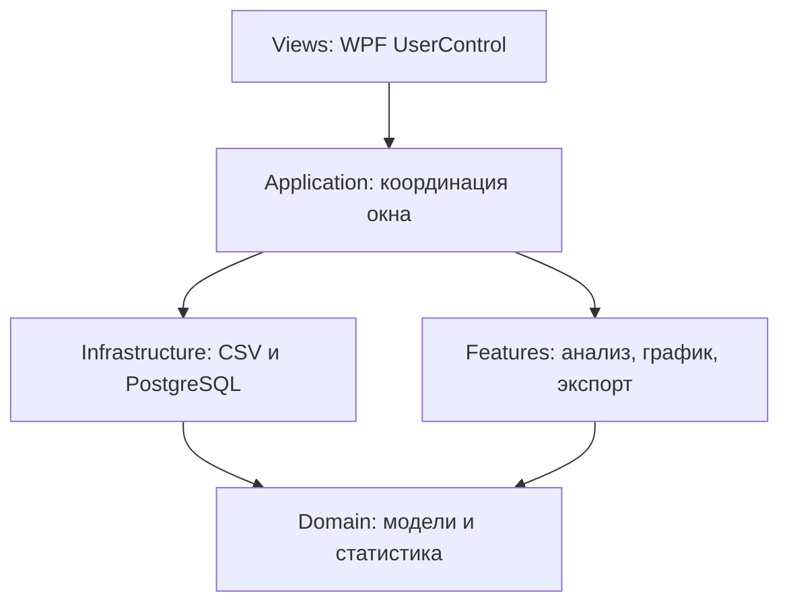

# EngineAnalyzer — архитектура проекта

## Назначение

EngineAnalyzer восстанавливает состояние двигателя из CSV или событий `public.trends`, учитывает длительность каждого состояния и формирует:

- 3D-поверхность временно-взвешенного RMS отклонения оборотов;
- матрицу коэффициента вариации COV по выбранным осям X/Y;
- печатные версии графика и таблицы;
- книгу Excel с матрицей COV и цветовой шкалой.

Проект организован по слоям и функциям. `MainWindow` остаётся WPF-компоновщиком, элементы интерфейса вынесены в отдельные `UserControl`, а поведение окна разбито на тематические partial-классы.

## Структура каталогов

```text
EngineAnalyzer/
├── App.xaml
├── App.xaml.cs
├── GlobalUsings.cs
├── ARCHITECTURE.md
│
├── Application/
│   ├── MainWindow.Core.cs
│   └── MainWindow.UI.cs
│
├── Domain/
│   └── AnalysisModels.cs
│
├── Infrastructure/
│   └── DataSources/
│       ├── MainWindow.Csv.cs
│       └── MainWindow.PostgreSql.cs
│
├── Features/
│   ├── Analysis/
│   │   └── MainWindow.Analysis.cs
│   ├── Export/
│   │   └── MainWindow.ExportAndPrint.cs
│   └── Visualization/
│       └── MainWindow.Plot3D.cs
│
└── Views/
    ├── MainWindow.xaml
    ├── MainWindow.xaml.cs
    ├── Controls/
    │   ├── ControlPanelView.xaml
    │   ├── ControlPanelView.xaml.cs
    │   ├── StatusPanelView.xaml
    │   └── StatusPanelView.xaml.cs
    ├── Matrix/
    │   ├── CovMatrixView.xaml
    │   └── CovMatrixView.xaml.cs
    └── Plot/
        ├── SurfacePlotView.xaml
        └── SurfacePlotView.xaml.cs
```

## Зависимости слоёв



Правила зависимостей:

- `Domain` не зависит от WPF, PostgreSQL или OxyPlot;
- `Infrastructure` отвечает только за получение и восстановление данных;
- `Features` выполняют анализ и формируют результаты;
- `Views` содержат разметку и не выполняют расчёты;
- `Application` соединяет представления, обработчики и функциональные модули.

## Views

### Views/MainWindow.xaml

Главное окно содержит только компоновку: `ControlPanelView`, вкладки `SurfacePlotView` и `CovMatrixView`, а также `StatusPanelView`. `App.xaml` открывает окно по адресу `Views/MainWindow.xaml`.

### Views/Controls/ControlPanelView.xaml

Содержит кнопки, выбор CSV-столбцов, PostgreSQL ID, названия осей, диапазоны, шаги, параметры анализа и подключения. Контрол не выполняет расчёты. События подключаются в `WireUiEvents()`.

### Views/Plot/SurfacePlotView.xaml

Содержит только OxyPlot `PlotView`. Вращение и масштабирование обрабатываются модулем визуализации.

### Views/Matrix/CovMatrixView.xaml

Содержит описание матрицы и виртуализированный `DataGrid`. Строки соответствуют оси X, столбцы — оси Y, ячейки — COV в процентах.

### Views/Controls/StatusPanelView.xaml

Содержит строку состояния и индикатор прогресса.

## Application

### Application/MainWindow.Core.cs

Содержит параметры сеток, карту сигналов, кэш состояний, ячейки результатов, модель OxyPlot и состояние камеры.

Основные функции:

- `MainWindow()` — инициализация окна;
- `WireUiEvents()` — подключение кнопок, списков и мыши;
- `ConfigureGrid()` — проверка параметров и создание сеток;
- `ClearData()` — очистка результатов;
- `SetupPlot()` — настройка OxyPlot.

Свойства-адаптеры, например `Plot`, `SurfaceMatrixGrid` и `GraphTempMinTextBox`, связывают feature-код с дочерними представлениями. Остальным partial-файлам не требуется знать XAML namescope каждого `UserControl`.

### Application/MainWindow.UI.cs

Содержит обновление, состояние `busy`, прогресс, сообщения об ошибках, разбор чисел и дат, CSV-парсер и общие математические функции.

Кнопка **Обновить** использует кэш при изменении сеток или номинала и перечитывает источник при изменении сигналов, подключения либо периода.

## Infrastructure

### Infrastructure/DataSources/MainWindow.Csv.cs

После выбора файлов заголовки первого CSV загружаются в выпадающие списки. Пользователь выбирает время, ось X, ось Y и Engine Speed либо готовое отклонение.

Пустые значения протягиваются вперёд. Состояние действует до времени следующей строки. Между несколькими CSV состояние продолжается в порядке выбора файлов.

### Infrastructure/DataSources/MainWindow.PostgreSql.cs

`public.trends` рассматривается как журнал событий:

```text
t  — время
id — ID сигнала
v  — новое значение
```

Перед началом периода читается последнее непустое значение каждого ID. Затем изменения обрабатываются по времени, а состояние между соседними событиями получает временной вес.

Значения по умолчанию:

| Назначение | ID | Имя |
|---|---:|---|
| X | 569 | IntTempOut |
| Y | 558 | Power |
| RPM | 625 | Engine Speed |

## Domain

### Domain/AnalysisModels.cs

`AggregateCell` хранит количество интервалов, вес в секундах, сумму, сумму модулей, сумму квадратов, минимум и максимум.

Вычисляемые показатели:

$$ \mu =\frac{ \Sigma (n \cdot \Delta t)}{Σ\Delta t} $$ 
$$ RMS = \sqrt{\frac{\Sigma((n_i - 1500)^2 \cdot\Delta t)}{Σ\Delta t}}  $$
$$ \sigma = \sqrt{\frac{\Sigma(n_i - \mu)^2}{\Sigma\Delta t}} $$
$$ COV = \frac{\sigma}{\mu} × 100% $$

Если отклонение постоянно равно нулю, `Mean = 0` и `σ = 0`; для отображения COV принимается равным `0%`.

`ScenePoint`, `ProjectedPoint` и `RenderSurfaceCell` описывают геометрию 3D-поверхности.

## Features

### Features/Analysis/MainWindow.Analysis.cs

Для обычного сигнала оборотов:

```text
deviation = abs(engineSpeed - nominalRpm)
```

Для готового отклонения:

```text
deviation = abs(sourceDeviation)
```

Интервал исключается, если значение не является конечным числом, длительность неположительна, отклонение превышает предел или X/Y не входят ни в один диапазон.

Индекс ближайшего узла:

```text
index = round((value - minimum) / step)
```

График получает RMS. Таблица получает `CoefficientOfVariationPercent`.

### Features/Visualization/MainWindow.Plot3D.cs

OxyPlot используется как двумерный холст собственной 3D-проекции:

1. `ToScene()` нормализует X, Y и RMS;
2. `ProjectPoint()` применяет повороты и перспективу;
3. поверхность строится из сортируемых по глубине `PolygonAnnotation`.

Управление: левая кнопка мыши — вращение, колесо — масштаб, **Сбросить вид** — исходная камера.

### Features/Export/MainWindow.ExportAndPrint.cs

Модуль отвечает за печать матрицы COV, печать текущего графика и формирование `.xlsx`. XLSX создаётся через `ZipArchive` и `XmlWriter`, поэтому отдельная Excel-библиотека не требуется.

## Цветовые шкалы

- поверхность: `0 rpm` — зелёный, `12 rpm` и выше — красный;
- матрица и Excel: `0% COV` — зелёный, `12% COV` и выше — красный.

Порог цвета не отбрасывает данные.

## Кэш

Ключ кэша:

```text
(X, Y, RPM или готовое отклонение, признак готового отклонения)
```

Для одинаковых состояний складываются длительности и количество интервалов. Это ускоряет перестроение сеток, но удаляет временной порядок. Для FFT, автокорреляции и поиска роста амплитуды потребуется отдельное хронологическое хранилище.

## Расширение

Новый источник должен восстановить `EngineState`, определить продолжительность состояния и вызвать `ProcessState()` и `FinishProcessing()`.

Накопительную статистику следует добавлять в `AggregateCell`. Новый экран создаётся в `Views/<Feature>`, подключается в `Views/MainWindow.xaml`, а его обработчики размещаются в соответствующем каталоге `Features`.

## Зависимости и сборка

```text
.NET 10 / WPF
Npgsql 10.0.3
OxyPlot.Wpf 2.2.0
```

```powershell
dotnet build ScottPlotWpfDemo.csproj
```

Имя проекта сохранено для совместимости, несмотря на переход со ScottPlot на OxyPlot.
